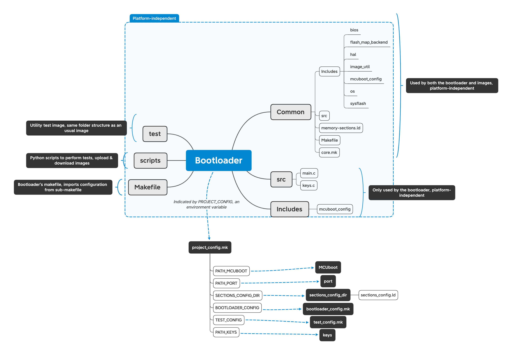
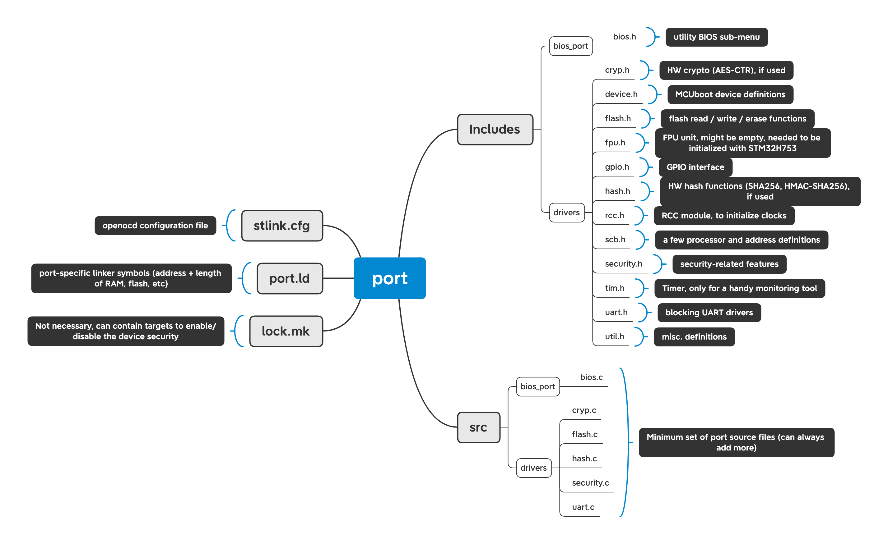

# Embedded secure boot: threat modeling and implementation with MCUboot

This project is a secure boot SW package for embedded devices using [MCUboot](https://github.com/mcu-tools/mcuboot), demonstrated with a simple FreeRTOS image. Developed as part of the Master thesis project of Alex Ferragni, supervized by [EPFL](https://www.epfl.ch) and [CSEM](https://www.csem.ch/Home).

The goal is to provide a safer environment to deploy firmwares when integrity, authenticity or even confidentiality are required.
The bootloader is capable of launching an image only if its signature is verified and recognizing encrypted updates to apply them.

In the end, it comes as a more practical wrapper around MCUboot and an example port on STM32H753 (as well as a fork of MCUboot with slight changes that were deemed desirable or necessary).

The implementation follows the design of MCUboot, with slight adjustments. In short, the bootloader is stored at the start of the flash memory, and two more important regions are defined: the primary slot (which contains the currently installed software) and the secondary slot (which is the place where an update should be put, in an encrypted state). The bootloader will always verify the primary image before booting and can apply updates if a valid update is detected in secondary slot. Additionally, it tries to fallback to the update in secondary slot if the primary slot is somehow corrupted. For a complete description (and including the threat model), please refer to the [thesis](thesis.pdf).

## Prerequisites

* GNU Arm Embedded Toolchain (link [here](https://developer.arm.com/tools-and-software/open-source-software/developer-tools/gnu-toolchain/gnu-rm/downloads))
* A compatible device (for now, STM32H753, otherwise see the [platform prerequisistes](#platform-prerequisites))
* OpenOCD to program the flash storage ([OpenOCD 0.11.0](http://openocd.org)) (other tools are imaginable, but all targets using openocd should be modified, they are only compatible with OpenOCD right now)
* A tool to communicate with the device's UART (e.g. [CoolTerm](https://freeware.the-meiers.org))

## Table of Contents

* [Files organization](#files-organization)
* [Installation](#installation)
* [How to use](#how-to-use)
* [Deployment](#deployment)
* [Threat model](#threat-model)
* [Licenses](#licenses)
* [Credits](#credits)

See also:

* [How to create a compatible image](image.md)
* [Porting guide](porting.md)
* [Utility BIOS](utility_bios.md)
* [Testing](testing.md)

## Files organization

### Bootloader folder

Since the bootloader required some files that are port-specific, and many files must be shared by the bootloader and images, the following architecture was chosen:

All files in the `Bootloader` folder (except for the example port) are platform-agnostic and the link with platform-specific information will be done with a `PROJECT_CONFIG` environment variable.

#### Common folder

The `Common` directory contains all files that may need to be shared by the bootloader and images, such as memory layout, drivers, makefiles and MCUboot interface in general. In particular, it contains:

* `memory-sections.ld`, the common linked script that defines regions and symbols necessary for the bootloader and images
* `core.mk`, which contains the core targets and symbols to compile files, imported by both images and the bootloader. Since it is used in different contexts, it requires multiple variables to be set (that work like parameters) such as the list of source files or include directories. You should not need to worry about this file, wrappers exist for both the bootloader and images.
* `Makefile`, a makefile that can be used by images. It is a wrapper around `core.mk` and defines targets to generate images using the image script and targets to flash the images. It requires multiple variables to be set (that work like parameters, such as a list of source files, the target name, the keys used to prepare the image and location of the MCUboot folder). An error will be thrown if any of them is missing, for clarity.
* `Includes`, a folder containing the platform-independent part of all headers that can be used by images.
* `src`, a folder containing corresponding implementations.

All files in this directory are platform-argnostic. All platform-dependent definitions or implementations are relayed to a port folder. Therefore, the `Common` directory uses a number of symbols and functions that should be defined in the port, as explained in the [port](porting.md) folder section.
(with port folder, everything else is almost platform agnostic)
(sources/headers that are needed by bootloader + images, linker script, test)

#### Makefile

This makefile is another wrapper around `core.mk` that is used by the bootloader. It defines everything that is port-independent that is necessary to compile and flash the bootloader. It includes targets to prepare tests and generate fresh cryptographic keys.

#### project\_config.mk

To make the link between the platform-agnostic `Bootloader` folder and the port, a single `PROJECT_CONFIG` environment variable should be defined. It must contain the full path to the `project_config.mk` cofiguration file, which must in turn define all variables that are specific to a given project (i.e., an instantiation of a bootloader and all images that are compatible with this one).

### Port folder

All hardware-dependent definitions that the Bootloader (or any image) requires should be contained in a single hardware-dependent port folder. Its architecture should be the following:

Since this folder contains a number of definitions and files that are mandatory in order to be used, a template port is available [here](Bootloader/Common/template/port_template). More files or definitions can be added on a per-port basis, but the template architecture should be kept and every definition should be filled (unless specified explicitely, in the tempalte). The template contains a full description of every prototype wand what it should contain. This folder should be used as a documentation for new ports. Additionally, the [STM32H753](Bootloader/Common/STM32H753) port can be used as an example.

The `Includes` folder contains all header, while the `src` folder contains all source files. The `stlink.cfg` file should containg OpenOCD's configuration file. It should contain all commands necessary to prepare the state of the device such that a `program` command can be issued immediately after that. The `port.ld` file contains symbols that define the memory architecture of the device. Finally, the `lock.mk` file can be left empty but can also contain all device-specific makefile targets that should be used by the bootloader. In particular, it is intended to contain targets capable of enabling (or disabling) the device security manually.

### Image

The structure of an image is fairly simple, as there is no imposed structure and it can use most of the shared resources if necessary. The link with the `Common` folder should be done in the image's makefile. Two example images are provided: [hello\_world](hello_world)(which is a minimal yet fully functional image) and [FreeRTOS-Image](FreeRTOS-Image)(which is an example of image that runs FreeRTOS whith a simple payload)

The image should however meet certain prerequisites. See the [Creating a compatible image](image.md) chapter for a full list of constraints.

## Installation

First of all, you need to clone this repository. Additionally, you should pull submodules using `git submodule update --init --recursive`.

Then, there are certain things you need to setup to use the secure bootloader (not including the [prerequisites](#prerequisites)).

You'll then need to choose a port (i.e., platform for which drivers are implemented). You can either use the example port for STM32H753, or you'll have to implement your own (see [Porting the bootloader](porting.md)). If you use STM32H753, an additional step is required to use the port.

To safely store keys on the STM32H753, we rely on the secure area. This requires two functions, `resetAndInitializeSecureArea` and `exitSecureArea`. Unfortunately, the code necessary to setup and use the secure area is under ST's license and cannot be shared in an open-source environment. For this reason, you will have to request ST's Secure Boot and Secure Firmware Update (SBSFU) yourself [here](https://www.st.com/en/embedded-software/x-cube-sbsfu.html).

You should then create two files, `STM32H753/src/st/rss.c` and `STM32H753/Includes/st/rss.h`. They should contain the prototype and definition of two functions: `void resetAndInitializeSecureAreas(void)`, which will configure the secure area to correspond to the bootloader area (no more, no less), and `exitSecureArea(uint32_t vectors)` which should close the secure area and use the input vector table to jump to the application. More information in the [reference manual (p.249)](https://www.st.com/resource/en/reference_manual/dm00314099-stm32h742-stm32h743-753-and-stm32h750-value-line-advanced-arm-based-32-bit-mcus-stmicroelectronics.pdf).

### Setting up keys

Then, cryptographic keys need to be setup. This includes an ECDSA key pair to sing the images and an ECIES key pair to distribute encryption keys. The keys used by the makefile to generate images should be in a .pem format, while keys embedded in the bootloader should be in a .c format, with specific variables defined. For simplicity, the keys can simply be generated using the bootloader's makefile, by executing `make generate_keys OUTPUT_DIR=[some output directory]`. Note that keys ending with "\_priv" should be kept securely and published nowhere. Alternatively, example keys are available in the [keys example](Bootloader/Common/keys_template) folder. They can be used in a development build (but should be changed for a production build!).

### Setting up project\_config.mk

You need to setup the `project_config.mk` file that will contain all information that are common to a given project (i.e., an instance of the bootloader and all compatible images, on a given device). It is used to make the link between generic files and port-specific or project-specific files. For STM32H753, [project\_config\_stm32h753.mk](Bootloader/Common/project_config_stm32h753.mk) can be used as-is.
It should define at least the following variables:

- `PATH_MCUBOOT`, the complete path to the MCUboot folder (defaulted to the included MCUboot submodule, but can be set to any fork of it if you need to make changes to it)
- `PATH_PORT`, the complete path to the port folder, more on that in the [port](porting.md) folder section.
- `SECTIONS_CONFIG_DIR`, the complete path to the folder that contains a `sections_config.ld` linker script. This file configures the size of different MCUboot regions. More on that below in the [sections\_config.ld](#setting-up-sections_configmk) section.
- `BOOTLOADER_CONFIG`, the complete path to the `bootloader_config.mk` file, which is where all port-specific source files and header that only bootloader uses should be added, as well as any variable that depends on the port. It should mainly be used to add values to the `SRC_FILES` variables, to add .c files to the bootloader, and to the `INCLUDE_PATHS`, to add include paths to the bootloader. Platform-specific compilation flags can be added by defining an `ADDITIONAL_CFLAGS` variable.
- `TEST_CONFIG`, the complete path to the `test_config.mk` file, which is where all port-specific source files and header that the tests use should be added, as well as any variable that depends on the port. Similarly to `bootloader_config.mk`, `SRC_FILES`, `INCLUDE_PATHS` and `ADDITIONAL_CFLAGS` can be used.
- `PATH_KEYS`, the complete path to the `keys` folder, as generated by the bootloader's makefile. It defines keys that will be used by the image generation script or embedded in the bootloader.

Additionally, a few variables can be used to configure the toolchain, if necessary (they have a default value in case they are not defined):

- `COMPILER`, which contains the name of the compiler. Default: `arm-none-eabi-gcc`.
- `OBJCOPY`, which contains the name of the objcopy tool. Default: `arm-none-eabi-objcopy`.
- `OPENOCD`, which contains the name of the openocd executable. Default: `openocd`.

Then, the `PROJECT_CONFIG` environment variable should contain the path to your `project_config.mk` file, so that the bootloader and images can access it. This can be done, for example, by using `export PROJECT_CONFIG=[some path]` in your shell.

### Setting up sections\_config.ld

This file contains the size of different regions used by MCUboot. Keep in mind that there are other constraints on the different sizes, depending on the device. Some constraints imposed by MCUboot or the bootloader are already defined in `memory-sections.ld`, in the form of asserts. Again, [a template file](Bootloader/Common/template/sections_config.ld) can be used directly, if it is compatible with a device's memory. This file should be created with at least the following variables:

- `_lnBootloader`, the length of the bootloader area. Should be a multiple of the flash sector size.
- `_lnBootloaderStorage`, the length of the secure bootloader area, which is at the end of the bootloader area. It is included inside the length of the bootloader area.
-  `_lnImg`, the maximum length of an image. Should be a multiple of the flash sector size.
-  `_lnImgHeader`, the length of an image header, which is included in the size of an image.
-  `_lnScratch`, the length of the scratch area. Should be a multiple of the flash sector size.

### Building

Finally, you should successfully compile the bootloader by executing `make` inside the `Bootloader` directory.

## How to use

To use the bootloader, you first want to [compile and install it](#installation). Then, you want to choose [a compatible image](image.md). Once you have an image, you can install it using the output binaries. You can either install it in primary slot using the image makefile command: `make flash`, which will install the signed image in primary slot, or execute `make flash_sec`, which will install the signed an encrypted image in secondary slot (in which case you will have to let the bootloader install it).

If you included the [utility BIOS](utility_bios.md) in the bootloader (only during development), you can launch it by requesting it while the board restarts. During the boot sequence, the BIOS will be lanched if `$(PATH_PORT)/Includes/drivers/gpio.h:GET_USER_INPUT_STATE() != 0`.

Note that the board security does not necessarily need to be enabled during a development build.

The bootloader will, after each reset, automatically look for an image in the primary slot and execute it only if it can verify its signature. Additionally, it will install a valid update if an encrypted image with a valid signature is located in secondary slot and has its upgrade flag set. This means that to install an update, the primary image itself should download an update (`$(OUTPUT_DIR)/$(TARGET)_enc.bin`, as generated by the image makefile) and store it in the secondary slot, then mark it for update by calling `$(PATH_MCUBOOT)/boot/bootutil/src/bootutil.c:boot_set_pending(1)`. 

After a reset, the bootloader will recognize the update and swap both images. Effectively, the new image will now be decrypted in primary slot, and the previous version is re-encrypted in the secondary slot, for redundancy. The reason is that if the primary image is ever corrupted, the bootloader will try to look for a backup of the previous version in the secondary slot, and if it contains a valid image it will install it.

Otherwise, if no image is installed, the bootloader will refuse to boot and hang.

## Deployment

To deploy a final version of the bootloader, you should carefully verify the following:

* Make sure the BIOS is disabled in the bootloader. It should never be included in a final version of the bootloader.
* Check your configuration, as there is no going back (in particular, it will not be possible to increase the maximum image size afterwards!)
* Make sure the keys are setup properly (and kept safely!).
* Make sure verything works as expected, the bootloader can verify your image, your image can download an update and it can be applied
* Make sure your first image can lock the device from within the image and update itself.
* Make sure ___all___ of your images can download updates and mark them for update.

Finally, you can setup the device by following those steps:

* Install the bootloader on the board: `make flash` from the bootloader makefile.
* Install your first image (which is able to lock the board): `make flash` from the image makefile.
* Let the image run, use it to fully lock the device.
* Use your image to download a "real-world" update, which may include less debugging features. Apply the update
* If your first image is sensitive (e.g., has debugging features that the user should not use), download another update to erase the content of the secondary slot. You can for example download the same image again, or download any invalid file which will not be applied but will still replace the content of the secondary slot.

Then, the system is fully ready!

## Threat model

The secure bootloader is designed for a threat model deisgned in [the thesis](thesis.pdf). You should thus refer to this thesis for more information on the subject.

In short, it is mainly designed to prevent physical non-invasive attackers from persistently jailbreaking the device (i.e., by keeping control of the device after a reset even without further intervention). It is also designed to be robust against bricking even if the device looses power or is reset multiple times during an update (a feature inherited from MCUboot). Finally, it offers some degree of confidentiality of the images by using a decrypted version of the images only in internal memory. Someone that has no access to internal memory should not be able to read the content of an image, even during an update.

## Licenses

Most of the files we created and implemented are licensed under "Apache 2.0", as indicated in the header of files and in the [LICENSE](license) file.

However, other projects were used during development, and their licenses are thus extended to any file that was inspired or copied from them. Again, this is mentioned in the header of each file and in the [LICENSE](license) file. More specifically:

* The MCUboot fork is lisenced under Apache 2.0.
* The files inspired by [an example port of MCUboot](https://github.com/memfault/interrupt/tree/master/example/mcuboot) are licensed under "MIT".
* Files derived from STMicroelectronics drivers are licensed under "3-clause BSD".
* FreeRTOS and its image are licensed under "MIT".